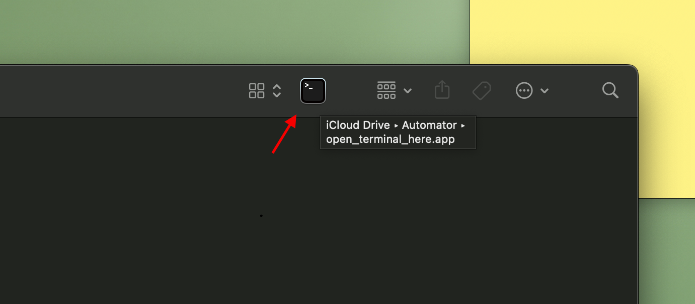

# Open Terminal at Current Folder

Opens terminal window at the current open folder path. This is different from _**'New Terminal at Folder'**_. While default service option requires parent folder to be selected, right clicked and choose option from Quick Actions; this automation makes it possible with a single click.



---

## Steps

- Generate quick action file (already avaiable at bin/open_terminal_here.app)
  - Automator > New Application
  - Add _**'Run Apple Script'**_ Node
  -

    ```Apple Script
    tell application "Finder"
        if exists Finder window 1 then
            set currentFolder to target of Finder window 1 as alias
        else
            return
        end if
    end tell
    tell application "Terminal"
        do script "cd " & quoted form of POSIX path of currentFolder & "; clear"
        activate
    end tell
    ```

  - Save as an application.
- Cmd + drag on the Finder Toolbar.

---

### Citation

- [Original Guide](https://apple.stackexchange.com/questions/359729/keyboard-shortcut-to-open-terminal-at-the-current-folder-location-in-finder)
